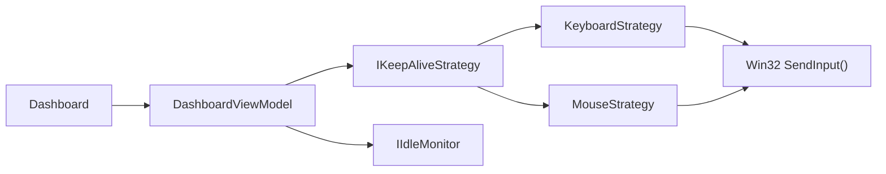

<div align="center">

# KeepMeAlive

**Keep your presence active - effortlessly.**

KeepMeAlive is a lightweight, privacy-respecting Windows utility that prevents Microsoft Teams and similar collaboration platforms from switching your status to *Away* during short breaks or hands-off periods.

[](https://github.com/GorangN/KeepMeAlive/releases/latest)
[](https://dotnet.microsoft.com/)
[](https://learn.microsoft.com/en-us/dotnet/desktop/wpf/)
[](LICENSE)
[](https://github.com/GorangN/KeepMeAlive/actions)
[](https://www.microsoft.com/windows)

</div>

---

## Why KeepMeAlive?

Remote work means presence matters. A 5-minute coffee break or a quick call should not leave your status stuck on *Away* - costing you missed messages, awkward follow-ups, or the appearance of being offline.

KeepMeAlive solves this with **a single, silent process** that keeps your session alive exactly when you need it, without interfering with your workflow or typing.

- No admin rights required
- No background services or drivers
- No data collection - fully offline
- Runs in your system tray, completely out of the way

---

## Features

<table>
<tr>
<td width="50%">

###  Keep-Alive Engine

Two precision input strategies keep your session active:

- **Keyboard ping** - sends a harmless LeftShift scan code that registers as activity without affecting your work
- **Mouse nudge** - moves the cursor by 1-5 pixels and back, invisible to the eye

</td>
<td width="50%">

###  Smart Intervals

- Configurable ping interval (60-90 seconds recommended)
- Built-in **random jitter** (+/-15 s) to avoid robotic patterns
- Live idle-time display so you can verify it is working

</td>
</tr>
<tr>
<td>

###  System Tray Integration

- Minimal footprint - lives entirely in the tray
- Dynamic icon reflects running / stopped state at a glance
- Show or hide the window with a single click

</td>
<td>

###  Display & Sleep Control

- Optional system keep-awake via `SetThreadExecutionState`
- Prevents display sleep during active keep-alive sessions
- Automatically restores normal power settings on stop

</td>
</tr>
<tr>
<td>

###  Dark & Light Themes

- Dark, Light, and **System** (auto-follow Windows theme) modes
- Live theme switching - no restart required
- Clean, modern UI with Fluent-inspired aesthetics

</td>
<td>

###  Windows Startup Integration

- Optional launch on Windows sign-in
- Starts silently in the tray - no window shown on boot
- One toggle in Settings - no manual registry editing

</td>
</tr>
</table>

---

## Screenshots

Screenshot assets are being refreshed to match the current KeepMeAlive branding and layout.

---

## Getting Started

### Requirements

| Requirement | Minimum |
|-------------|---------|
| Operating System | Windows 10 (1903) or Windows 11 |
| Runtime | [.NET 8 Desktop Runtime](https://dotnet.microsoft.com/download/dotnet/8.0) |
| Privileges | Standard user - no admin required |

### Installation

**Portable release**

1. Download `KeepMeAlive-Portable.zip` from [**Releases**](https://github.com/GorangN/KeepMeAlive/releases/latest)
2. Extract it to any folder, for example `C:\Tools\KeepMeAlive`
3. Ensure the [.NET 8 Desktop Runtime](https://dotnet.microsoft.com/download/dotnet/8.0) is installed
4. Run `KeepMeAlive.exe`

Portable releases are `framework-dependent`, `win-x64`, and multi-file by design. By default they store settings in a local `Data` folder beside the executable. You can switch the storage mode to `%APPDATA%\KeepMeAlive` from the app preferences.

---

## How It Works



1. You configure the method and interval on the **Dashboard**
2. On **Start**, a `DispatcherTimer` fires at your chosen interval (with random jitter)
3. The selected strategy calls `SendInput()` - a Windows API that injects a minimal, invisible input event
4. Your system (and Teams) registers activity -> your status stays **Available**
5. The **Idle Monitor** reads `GetLastInputInfo()` every second and shows your real idle time, confirming it is working

---

## Notes

> **Does not work on a locked PC.** Windows and Teams will still show *Away* when the session is locked - KeepMeAlive requires an active, unlocked session.

> **Enterprise security policies** may block synthetic input on managed devices. Use the live idle-time display to verify your environment supports it before relying on it.

---

## Architecture

KeepMeAlive is built on **Clean Architecture** with strict **MVVM** separation and **Dependency Injection** throughout.

```text
KeepMeAlive/
|-- Models/                  # Domain - AppSettings, LicenseInfo, SubscriptionTier
|-- Services/
|   |-- Interfaces/          # Abstractions - IKeepAwakeService, IIdleMonitorService...
|   |-- Keyboard/            # KeyboardStrategy_ScanCodeShift, KeyboardStrategy_VirtualKey
|   |-- Mouse/               # MouseStrategy
|   |-- KeepAwakeService     # SetThreadExecutionState wrapper
|   |-- IdleMonitorService   # GetLastInputInfo wrapper
|   |-- AppRuntimeModeService # Portable marker + bootstrap-based storage selection
|   |-- SettingsService      # JSON persistence in local or profile storage
|   |-- SecretStore          # Credential Manager or DPAPI-protected portable secrets
|   |-- ThemeService         # System theme detection + live switching
|   |-- StartupService       # HKCU Run registry key management
|   |-- StartupSyncService   # Future startup sync hook, currently local no-op
|   `-- UpdateService        # Optional GitHub Releases API version check
|-- ViewModels/              # MainViewModel, DashboardViewModel, SettingsViewModel
|-- Views/                   # DashboardView.xaml, SettingsView.xaml (zero code-behind)
|-- Messages/                # WeakReferenceMessenger message types
|-- Helpers/                 # Interop.cs - P/Invoke declarations
`-- Resources/
    |-- Icons/               # tray_active.ico, tray_inactive.ico
    `-- Themes/              # DarkTheme.xaml, LightTheme.xaml
```

**Key patterns:**
- **Strategy Pattern** - swap keep-alive methods without changing the timer logic
- **Messenger (WeakReference)** - decoupled ViewModel-to-ViewModel communication
- **Single-Instance Enforcement** - Mutex + Named Pipe IPC; secondary launches bring the window to focus

**Stack:**

| Component | Technology |
|-----------|-----------|
| UI Framework | WPF (.NET 8) |
| MVVM | CommunityToolkit.Mvvm 8.4 |
| DI Container | Microsoft.Extensions.DependencyInjection 9 |
| System Tray | Hardcodet.NotifyIcon.Wpf 1.1 |
| Settings | System.Text.Json |
| IPC | System.IO.Pipes (Named Pipes) |

---

## Building from Source

```bash
# Clone the repository
git clone https://github.com/GorangN/KeepMeAlive.git
cd KeepMeAlive

# Restore dependencies and build
dotnet restore
dotnet build -c Release

# Publish the portable release layout
dotnet publish KeepMeAlive/KeepMeAlive.csproj -c Release -p:PublishProfile=Portable

# Run
dotnet run --project KeepMeAlive/KeepMeAlive.csproj
```

> Requires the [.NET 8 SDK](https://dotnet.microsoft.com/download/dotnet/8.0) and Windows.

---

## Roadmap

- [x] Keyboard & mouse keep-alive strategies
- [x] Configurable intervals with random jitter
- [x] System tray with dynamic status icon
- [x] Dark / Light / System theme support
- [x] Windows startup integration
- [x] Live idle-time display
- [x] Single-instance enforcement with IPC
- [x] GitHub auto-update check
- [ ] License & subscription activation
- [ ] Scheduled keep-alive profiles (work hours only)
- [ ] Per-application trigger (activate only when Teams is running)
- [ ] Notification suppression mode

---

## Privacy

KeepMeAlive is **local-first and privacy-first by default**. It does not:

- Transmit any usage data, telemetry, or analytics
- Read, capture, or log your keystrokes
- Attempt to hide from antivirus, EDR, enterprise monitoring, or endpoint controls

Network behavior is explicit:

- Automatic GitHub update checks are **off by default**
- Startup account/license sync is **off by default** and currently a local no-op stub
- The only shipped network call is an optional unauthenticated `GET` to the GitHub Releases API for version comparison

Storage behavior is explicit:

- Portable releases default to `<AppFolder>\Data\settings.json`
- Profile storage uses `%APPDATA%\KeepMeAlive\settings.json`
- License keys are stored securely outside `settings.json`
  - `ProfileAppData`: Windows Credential Manager
  - `PortableLocal`: DPAPI-protected local file
- Windows startup writes `HKCU\Software\Microsoft\Windows\CurrentVersion\Run` only when you enable it

See [PRIVACY_DATA_FLOW.md](KeepMeAlive/docs/PRIVACY_DATA_FLOW.md) for the exact data flow and storage map.

---

## Contributing

Contributions are welcome. Please follow the established code style defined in [CLAUDE.md](CLAUDE.md) - zero warnings, XML documentation on all public members, strict MVVM with no logic in code-behind.

1. Fork the repository
2. Create a feature branch: `git checkout -b feature/your-feature`
3. Commit with a descriptive message linked to the relevant issue
4. Open a Pull Request against `main`

---

## License

Distributed under the [MIT License](LICENSE).

---

<div align="center">

Made for remote workers who just need a quick coffee break.

<br/>

[](https://github.com/GorangN/KeepMeAlive/stargazers)
&nbsp;
[](https://github.com/GorangN/KeepMeAlive/network/members)

</div>
